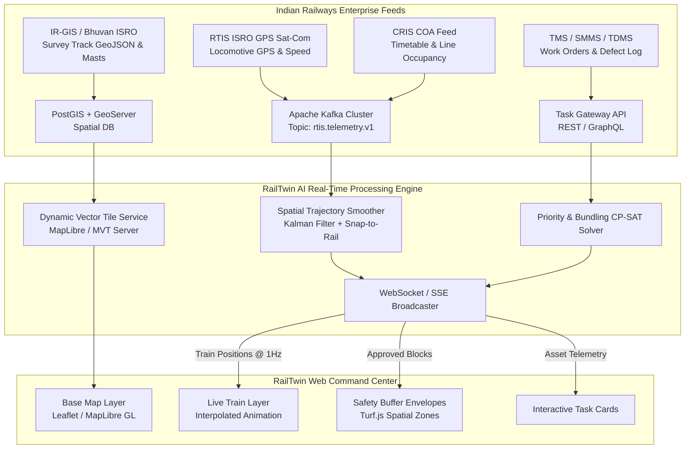

# Production Railway GIS Integration Guide
## Indian Railways Smart Command & Control Architecture
**Problem Statement 26027: AI-Powered Automatic Block Planning to Maximize Asset Availability for Train Operations on Indian Railways**

---

## 1. Executive Summary

This engineering document defines the technical roadmap for transitioning the **RailTwin AI Command Center** from client-side simulation to a **full-scale enterprise production GIS environment**. It details the integration with official Ministry of Railways (MoR) data systems including:
- **RTIS (Real-Time Train Information System)** by CRIS & ISRO
- **COA (Control Office Application)** by CRIS
- **IR-GIS / Bhuvan-Indian Railways** by ISRO & MoR
- **TMS, SMMS, TDMS** maintenance systems

---

## 2. Production Architecture



---

## 3. Real-Time Data Ingestion & Protocols

### 3.1. RTIS (ISRO Satellite Locomotive Telemetry)
- **Protocol**: Apache Kafka consumer with Protobuf/JSON schema.
- **Update Frequency**: $1\text{ Hz}$ to $0.2\text{ Hz}$ (1 to 5 seconds).
- **Payload Schema**:

```json
{
  "timestamp": "2026-08-29T10:14:32.102Z",
  "loco_id": "WAP7-30218",
  "train_number": "12042",
  "train_name": "Shatabdi Express",
  "latitude": 28.58331,
  "longitude": 77.53328,
  "speed_kmph": 128.4,
  "heading_deg": 114.8,
  "section_code": "GZB-ALJN",
  "track_line": "UP_MAIN",
  "current_kilometer": 41.2,
  "delay_minutes": 0,
  "next_station": "DER",
  "eta_next_station": "2026-08-29T10:18:00Z"
}
```

---

### 3.2. GeoJSON Track Centerline Ingestion (PostGIS)
In production, track centerlines are queried by division bounding box ($BBOX$):

```sql
-- PostGIS query to extract electrified mainline track geometry with milepost markers
SELECT 
    t.track_id,
    t.section_code,
    t.track_type, -- UP, DOWN, THIRD, DFCCIL
    t.electrification_type, -- 25kV AC
    t.max_permissible_speed,
    ST_AsGeoJSON(ST_Transform(t.geom, 4326)) as geojson_geometry
FROM railway_track_centerlines t
WHERE t.division_code = 'DLI'
  AND t.geom && ST_MakeEnvelope(77.20, 27.80, 78.20, 28.80, 4326);
```

---

## 4. Frontend Integration: Production Leaflet & MapLibre

### 4.1. Track Snapping & Marker Smoothing
Locomotives are snapped to the nearest railway centerline coordinate to eliminate raw GPS drift:

```javascript
import * as turf from '@turf/turf';

// Snap raw GPS coordinate to closest point on the track GeoJSON
export function snapToTrack(rawLat, rawLng, trackGeoJSON) {
  const rawPoint = turf.point([rawLng, rawLat]);
  const snapped = turf.nearestPointOnLine(trackGeoJSON, rawPoint);
  return {
    lat: snapped.geometry.coordinates[1],
    lng: snapped.geometry.coordinates[0],
    distanceMeters: snapped.properties.dist * 1000
  };
}
```

---

### 4.2. Spatial Block Safety Envelope Calculation (Turf.js)
When an AI-optimized bundle (e.g. `Bundle B-104`) is scheduled, generate a safety polygon with safety margin buffers:

```javascript
export function createMaintenanceSafetyZone(startCoord, endCoord, bufferMeters = 35) {
  const workSegment = turf.lineString([
    [startCoord.lng, startCoord.lat],
    [endCoord.lng, endCoord.lat]
  ]);
  
  // Calculate buffer envelope around track
  const bufferedPolygon = turf.buffer(workSegment, bufferMeters, { units: 'meters' });
  
  return {
    type: "Feature",
    geometry: bufferedPolygon.geometry,
    properties: {
      bundleId: "BUNDLE-B-104",
      departments: ["ENG", "SNT", "TRD"],
      powerCutRequired: true,
      blockType: "ABSOLUTE_BLOCK"
    }
  };
}
```

---

## 5. Air-Gapped / Railway Intranet Map Tile Deployment

To run inside Ministry of Railways secure control centers without internet access:

### Step 1: Export Railway GIS Tiles
Export the Northern Railway boundary into an `.mbtiles` package from OpenStreetMap or IR-GIS shapefiles.

### Step 2: Run Local TileServer GL Container
```bash
# Run local vector & raster tile server on port 8080
docker run --name railtwin-tileserver \
  --restart always \
  -v /var/railtwin/gis-data:/data \
  -p 8080:8080 \
  -d maptiler/tileserver-gl \
  --mbtiles /data/nr_delhi_railway.mbtiles
```

### Step 3: Connect Frontend Leaflet Layer
```javascript
// Point Leaflet directly to internal railway tile server
L.tileLayer('http://railtwin-tiles.internal:8080/styles/osm-bright/{z}/{x}/{y}.png', {
  maxZoom: 18,
  minZoom: 6,
  attribution: 'Indian Railways GIS • Bhuvan ISRO'
}).addTo(map);
```

---

## 6. Production Integration Milestone Schedule

| Phase | Milestone | Deliverables | Target Timeline |
|---|---|---|---|
| **Phase 1** | GeoJSON Centerline Ingestion | Export DLI/LKO division track shapefiles into PostGIS GeoServer | Weeks 1–2 |
| **Phase 2** | RTIS Live GPS Stream Integration | Implement Kafka consumer & WebSocket broadcaster with track-snapping | Weeks 3–4 |
| **Phase 3** | TMS/SMMS/TDMS REST Sync | Connect live work order APIs to the RailTwin CP-SAT solver | Weeks 5–6 |
| **Phase 4** | Offline TileServer Deployment | Configure air-gapped Docker TileServer for operational control centers | Week 7 |
| **Phase 5** | End-to-End Field Validation | Pilot on Ghaziabad–Aligarh (106 KM) & Delhi–Agra corridors | Week 8 |
